This is a [Next.js](https://nextjs.org) project bootstrapped with [`create-next-app`](https://github.com/vercel/next.js/tree/canary/packages/create-next-app).

## Getting Started

First, run the development server:

```bash
npm run dev
# or
yarn dev
# or
pnpm dev
# or
bun dev
```

Open [http://localhost:3000](http://localhost:3000) with your browser to see the result.

You can start editing the page by modifying `app/page.js`. The page auto-updates as you edit the file.

This project uses [`next/font`](https://nextjs.org/docs/app/building-your-application/optimizing/fonts) to automatically optimize and load [Geist](https://vercel.com/font), a new font family for Vercel.

## Learn More

To learn more about Next.js, take a look at the following resources:

- [Next.js Documentation](https://nextjs.org/docs) - learn about Next.js features and API.
- [Learn Next.js](https://nextjs.org/learn) - an interactive Next.js tutorial.

You can check out [the Next.js GitHub repository](https://github.com/vercel/next.js) - your feedback and contributions are welcome!

## Deploy on Vercel

The easiest way to deploy your Next.js app is to use the [Vercel Platform](https://vercel.com/new?utm_medium=default-template&filter=next.js&utm_source=create-next-app&utm_campaign=create-next-app-readme) from the creators of Next.js.

Check out our [Next.js deployment documentation](https://nextjs.org/docs/app/building-your-application/deploying) for more details.


# next.js overview
Next.js is a React framework that gives you buildig blocks to create web application.

By framework, we mean NEXT.js handles the tooling and configuration needed for React.

It provides additional structure, features and optimization for your application

Providing some options:
1. Built in optimization (image, font , icons are optimized and make performance better)
2. Pre-rendering (SSG + SSR)
3. Next level data fetching (React had client site data fetching but next.js has server site data fetching)
4. Powerful routing and layouts (Next.js has its built in routing where react used third party)
5. API routes (We had to use express and node.js and create a backend server but next.js has it built in)

# Why Next.js?
1. It's a fullstack framework
2. blazingly fast because of pre-
3. Contents are pre-generated
4. so site is SEO friendly

--> Framework: A framework can have multiple libraries. Framework already have third-party dependencies (Built in routing system, Api Routes, NextAuth for authetication)

-->Library: If we use library we need to install third-party packages  (React-router-dom, firebase, backend server using express)

## rendering Concept

Process of transforming code into visual and interactive web pages that users see and interact with on their browsers. 

Input : HTML, CSS, javaScript code

Process : The browser's rendering engine inteprets this code

Output : An intersctive web page


## What is rendering?
--> the process of turning HTML, CSS and JavaScript code into an interactive page  that website visitors exoect to see

--> rendering is of two types: pre-rendering(Next.js) and client site rendering (React)

--> Pre-rendering is of two types: SSG(Static site generation) and SSR( Server side rendering)

## CSR(client site rendering)

is a way of rendering web pages where most of the work is done in the browser (the client), not on the server.

before deploying the code we do "npm run build". after thid command a dist folder is created. in the dist folder there is a html code and the RecatJs code we have written gets translated into js code. 

when we request the website that is deployed in vercel or netlify from the browser, the codes comes from the hosting server to the browser. After coming to the browser the js code gets executed. while executing the js code it fetches the data from the backend that created with express. After some prcessing html and css files are created and a browser can show it as a website. That means js executing parts happens at the client side. 

1.  The server sends a basic page and some instructions (JavaScript) to your browser.
2.  The browser then takes those instructions, gets the full content (like text and images), and shows you the page.
3.  After the page is loaded, if you click buttons or do things on the site, the browser can update the page without needing to reload it.


Disadvantage of client side rendering is : after executing the js then HTML and CSS gets created. To execite the js code, it needs help of browser's v8 engine. SEO doesn't wait to execute those code. To execcute we need V8 engine or nodeJS. Search engine expects direct html and css. So client side rendering is not SEO friendly. 

## pre-rendering
--> the HTML gets re-generated from the server at first  then becomes visiblle in our website.

The JS get executed at the server end. the HTML and CSS that are created at the server end they are direcctly sent to the browser. 

Benefit is : As js is getting executed at the server end and sending html and css as response , so different search engine ca access the html and css, they can read the content. And in search result our website comes at the beginninng. So pre-rendering increases the SEO friendliness. 

pre-rendering can be two types: SSG(Static site generation) and SSR( Server side rendering); bothe from  the server but SSG is in built in and SSR is in on user request

## SSG(Static site generation)
This rendering happens at the build time, when we build the website before deploying ("npm run build"). 

We see the contents that are already deployed in the vercel and it gets visible. no dynamic content is there

This means that Next.js generates the pages of your website ahead of time when you build your site. These pages are ready to be shown to users immediately, making your website load super fast.

Content gets generated in built time and content just become viusible when we hit on the deloyed url

HTML and CSS are already created in the development phase and depployed in the server side. so if the user requests now , as the html and css are already cretaed , they will be sent as a response 
As js execution work is already done in the build phase , so we can get the fast response in this rendering. User end takes less processing so pages gets loaded faster.

## SSR( Server side rendering)
The rendering happens after the user requests for the web page. 

This means that when a user requests a page, the page is generated on the server at that moment, then sent to the user's browser. This is great for dynamic content that needs to be updated each time someone visits.

Data is not geting ready in built time, based on user request it gets generated from the server and then becomes visible to the browser

when a user requests for a web page , then at the server side the js code will be executed. while executing it will fetch all the needed data from the database. with the fetched data html and css will be created. those html and css will be given to the user as the response. so user will get direct html and css content instead of js. 

-----------NextJS supports server side rendering.--------------

## initiate creating next.js app
npx create-next-app@latest "app_name"

Why not using App Router?

--> The component we will create on app router like react, they will be server component, that will be generated from the server. These server components does not support many component libraries (like CSS library)

--> again we use "use client" at the top to define client site rendering
## npm run build
production code will be generated and run

## npm run start
production environment code will be run

## npm run dev
to run the application


--> page.js file is loaded as children of layout.js

--> page.js is the main home page

--> check nextjs -->get started -->project structure

## route
--> to create a route a folder is needed under the app folder

--> inside the folder file name must be page.js / page.jsx

--> Component name can be anything

--> after that route will be automatically created

--> for every route foder name will be similar to route name but page.jsx will be there

--> no capital letter will be there in route folder name, only lowercase

--> the route can be accessed by : http://localhost:3000/routeName

## route under route: nested route : about-->address-->
--> now if we want to create another route under about

--> we need to create a folder named in lowercase with the exact same name under the service route

--> inside the child route there will be again page.jsx file

--> the route can be accessed by : http://localhost:3000/about/address


## linking and navigation
--> <Link></Link> from next/link ; a built-in component that extends the HTML <a> tag to provide prefetching. (it fetch the component related things before clicking on it)

--> inside tag 'href' prop is a must

--> Another way is: using the useRouter()  hook

--> there are two useRouter()  hooks ; one from next/router another from next/navigation

--> we need the one from next/navigation

--> we can make private route with it


## dynamic route : [id]
--> create a folder under a route with name like : [id]

--> create a page.jsx file under it 

--> we can get the id by params ({params})

--> we can access the route by id  ; like params.id

--> the route will look like this : http://localhost:3000/services/2


## group route
we can organize if there are so many folders using the () under the app folder. we can mark a folder as a Route Group to prevent the folder from being included in the route's URL path.

for example , under the (authPages) there  are login and  register folder. now we don't access it like 
"/(authPages)/login"

here we can access it like --> "/login" directly (http://localhost:3000/login)

## show  different layout for different route
inside the group route (dashboard) we will create another layout.jsx file.

and we must the the {children} as parameter on that layout function


for individual layout we can even add layout.jsx inside the individual folder. like inside the user-dashboard folder we can create another layout.jsx.


## get the path of the current route
need a hook for that usePathname() from 'next/navigation

const pathName = usePathname()

console.log(pathName,pathName.includes("dashboard"))


## home/dynamic/dynamic/dynamic routes : catch all segments
[...id]  /   [...slugs]

here we want to catch all the routes dynamically

we must open page.jsx and add {params}

To check more: in next.js page--> dynamic routres-->catch all segments


## optional catch all segments

The difference between catch-all and optional catch-all segments is that with optional, the route without the parameter is also matched


## over-write the next.js default 404 page:

to over-write the default 404 page by the next.js we need to open a not-found.jsx file inside the app folder

for dynamic routes it won't show 404 with wrong id. so we need to validate the id

## loading spinner
create a page named loading.jsx inside app folder

## important
next.js bydefault stores the pages as cache. so we need to go to inspect-->network--> disable cache

## middleware
a function that works in request and response cycle. it checks if the request is valid or not. if valid it forwars to the server end

Middleware allows you to run code before a request is completed.

Then, based on the incoming request, you can modify the response by rewriting, redirecting, modifying the request or response headers, or responding directly.


we used it in mern where we fetched data from mongoDB. 


--> in next.js if we visit a server, when we hit the API from the nextJS client,a token comes with th e request. there is a middleware that checks if the request is valid or not. if the request is valid then its forwarded to the nextJS server.

--> it does not always happens that we  only make server  using nextJS . sometimes there can be external server made with expressJS. so if client sends requests to the ExpressJs server thast time the nextJS middleware won't work. 

--> we have to create middleware.js file in the app or src folder in the same level as pages. here we created under the src folder.


when we are requesting 'middleware(request)' for the about page. the request is read by (request) parameter. 

after getting the request  as next response its  redirecting to the "/" page

--> redirect


--> applying conmdition in the middleware and it hit the pathname. we can see in console with GET


-->rewrite: does not change the url. but loads and presents the component

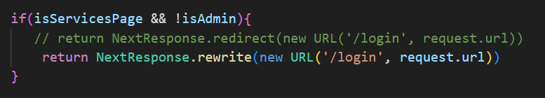


here as user is not admin , while requesting for the services page, url is same but the login content is there.
after user logged in, the he can access to the service page

## matcher in middleware:
matcher only matches one dynamic path if --> /about/:path

to match more -->  /about/:path*

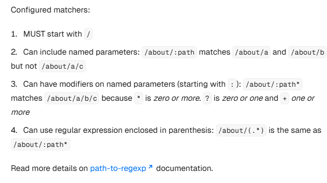


## middleware : cookies


we have created the cookies , now we will try to access it


after the login, if we get the token we can take decision based on it


## data fetching with SSR
we will create a separate function under posts-->page.jsx. 

previously we used useEffect now we are using a async function and the data is found cz nextJS out of the box creates server component .

as we haven't indicated anything like "use client" so it's automatocally a server component

take the posts link from the json placeholder


go to inspect--> network--> click one under name--> response


Here we can see an HTML file got loaded directly in the browser. response is comming as html directly by server side rendering. 

## Dynamic Data fetching
---->open dynamic route under post


----> inside the [id]'s page add params


--> Like previous data fetch with SSR we have to create a async function and fetch the data like previous 

--> but this time data fetch will be with id


## client side rendering

## when to use server and client component?
server component -->

1. Fetch data
2. access backend resource directly
3. keep sensitive informatin (access token, api keys)
4. keep large dependencies in server


client component -->
1. interactivity and event listener (onClick(), onChnage())
2. UseState and lifeCycle Events (useState(), useEffect(), useReducer())
3. use Web browser API'S only
4. use custom hooks


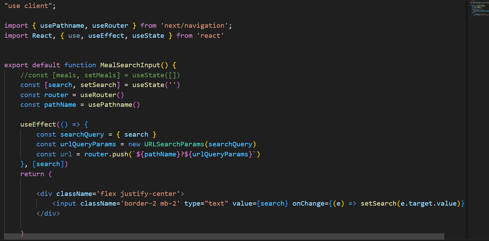
here we are creating a component is to get the value from the input field. and using that value create a searchParams 

searchParam is the question and search value in the url
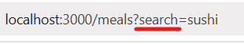


after searchParams , its routing us to that page


## styling with nextJS
sometimes we need to write raw css to customize package or library component. 

the golbals.css with the app is globally applicable. 

--> the globals.css file must be imported in layout.js

--> if we import this css file in any component those class will be  globally available. it can be used in any component.

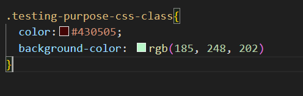

--> if we use it in page.jsx of [id]

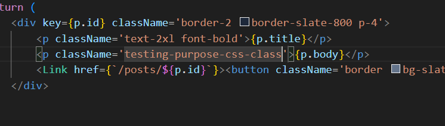

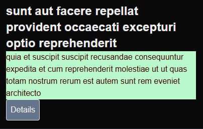


## styling for only one component

if we want to create a css class that will only be for one specific component

--> like for the page.jsx of post. file name must be with .module.css extension

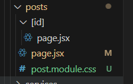

--> now import the css file

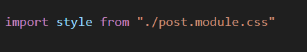


--> the add it dynamically

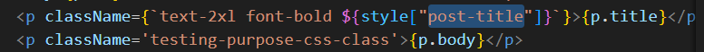


--> to make the class unique there is a unique identifier added before it

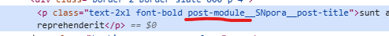

--> if we want to use this class in another component we need to import it. it's not globally available like globals.css

--> it's only component specific


## ui library

we can also use some ui library. shadcn/ui is a popular one now . https://ui.shadcn.com/

its a flexible and developer friendly one


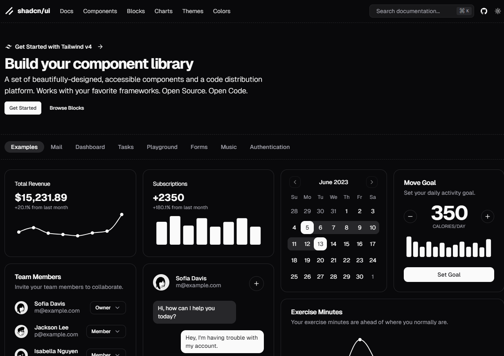


# features that only nextJS has

## metadata

1. what is metadata?

--> when we visit any website, that website is basically an html document. that html document has main two parts: <head> and <body>

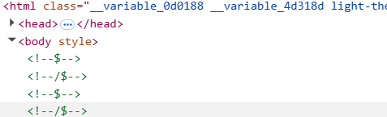

--> the contents we see in the website are loaded in the body

--> but the info about the website, what's the website about? what's it's ,main topics are those are containedmby the <head> tag


--> inside the <head> tag we can see some <meta> tag

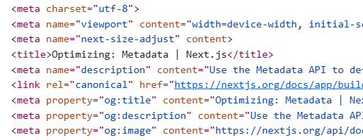


## 2. how can we set Metadata?

--> By default there are some metadata already given in the layout.js

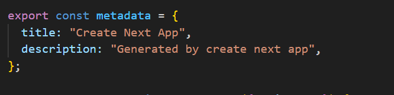

--> if we want to create metadata for individual pages we have to create the same variable like the layout.js

--> suppose we are creating metadata for the post page

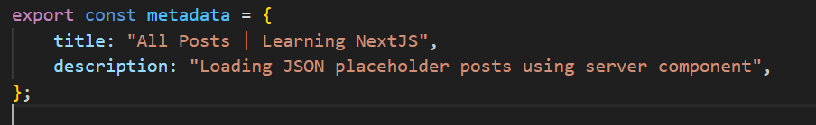

## Dynamic Metadata title:

--> we will make it dynamic in layout.js under app. layout is the top most component that will be inherited by all the children.

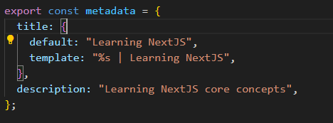

--> %s is a placeholder. in future something will be written here. mainly dynamic titles will come here

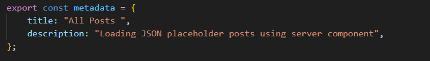

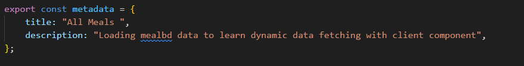

--> now even though we have only given the individual title, dynamic one will take it.


## dynamic metadata title for dynamic route ([id]):
there must be a function named generateMetadata()

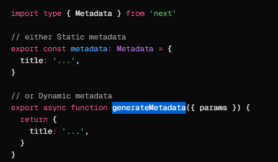

we have to fetch the data at first 


here, getSinglePost() is the function we used to fetch the data before

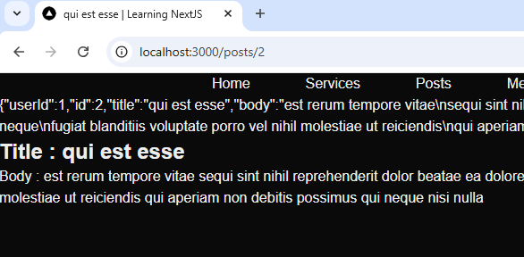

here we got the dynamic title along with the layout default part.

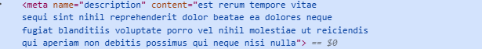

we can also see body of the content as the description as metadata inside the <meta> tag


## the things we can set as metadata

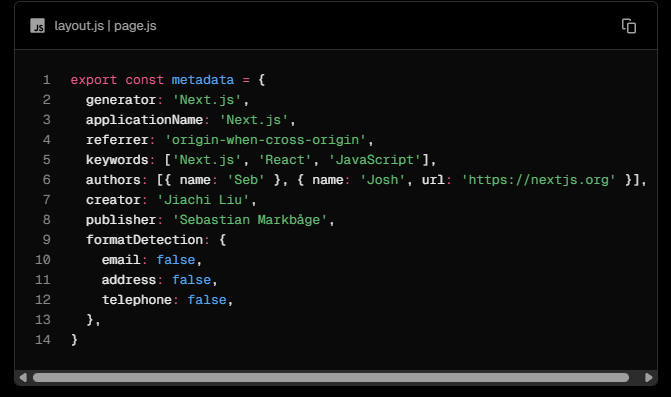

1. keywords: ['Next.js', 'React', 'JavaScript'],  --> here keywords is: if any user search in the search engine with those keywords this website will get the priority in the search engine. so we can set 

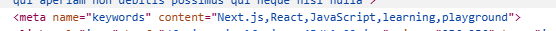

if we change the order of the keyword it also changes the order in search engine

2. we can also set the authors information, creators and publisher information


## Image optimization
we can get the optimized image by using <Image> tag


--> under the network tab in the img tab we can see the record of the image that got loaded with our scroll . 
--> the format of the image is webp

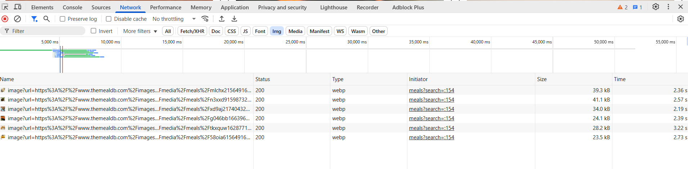

---> whereas the  tag loaded all the image at once

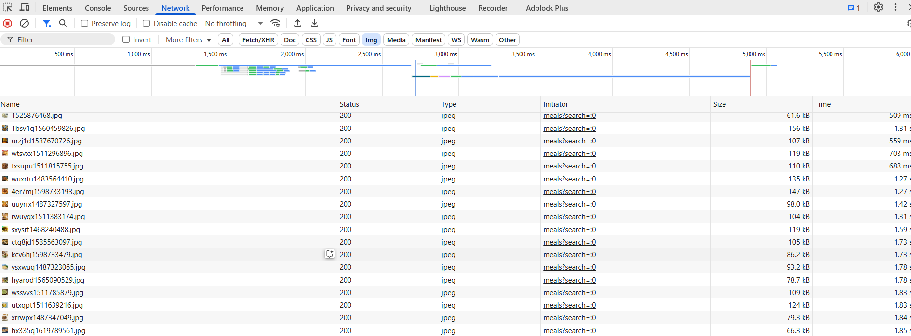

--> the size of the image with <Image> tag is much less than comapring with the  tag


--> here we are getting the optimized image and on scroll we are getting the lazy load


## font optimization:
if we check the layout.js file we can see there is already an default example given by nextJs

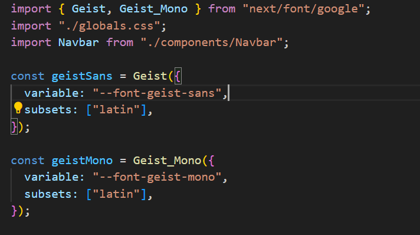

-->this font is imported from "next/font/google"

-->that means google fonts are already in the nextJS packages. we can just simply inport them and use them.

--> if we want to use another font here

1. we should import it at first

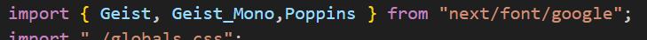

2. then we have to decalre a variable

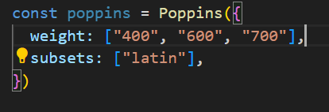

3. there is a suggestion what we need to give in the array object

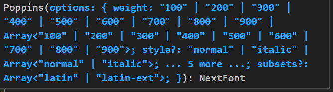

4. then we have to add it in the classname of the body

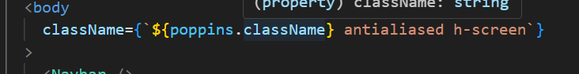


## font optimization for a specific individual page:

1.we will go to the page.jsx file of that specific page/route

2. we have to import the font there

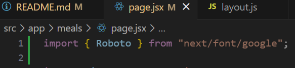

3. create the variable of the array of object

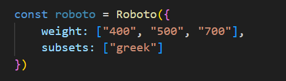

4. to apply it only on the cards we add in inside the classname

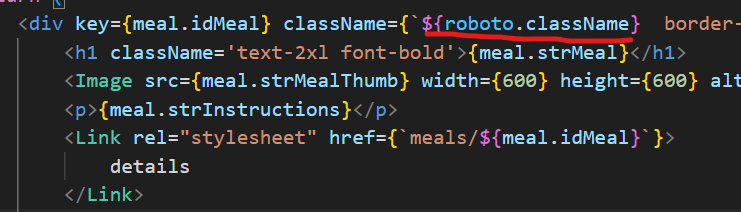


# handling error:
## next/imge:

--> in our configuration we haven't included the hostname

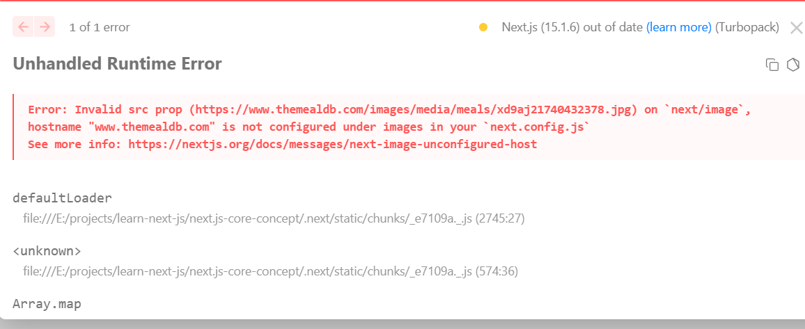


solution given by nextJS:

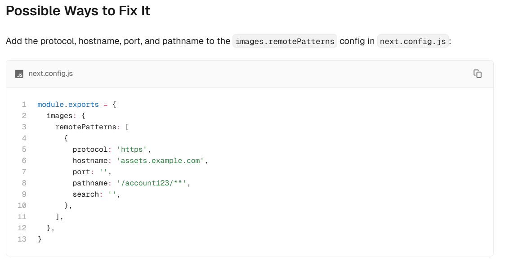

in our next.config.mjs we can see there is an empty object

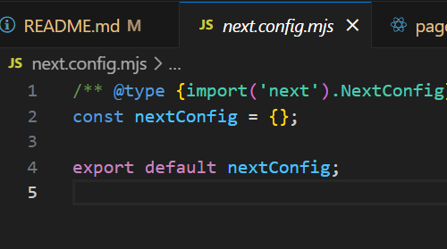

we will update the obaject according to the nextJS documentation and update the hostname with the given one in the error. we will remove the other properties of the  object that we don't need right now.

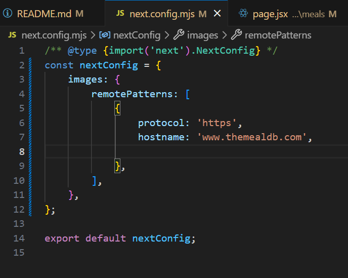

the problem is solved in that way


